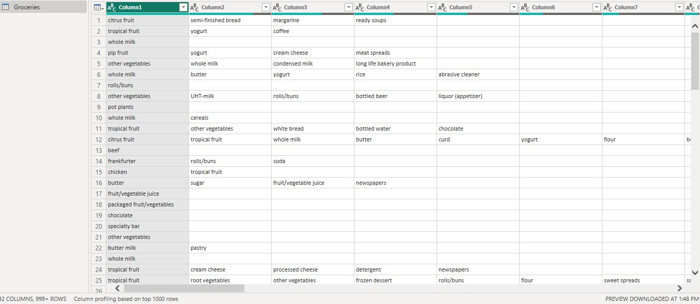
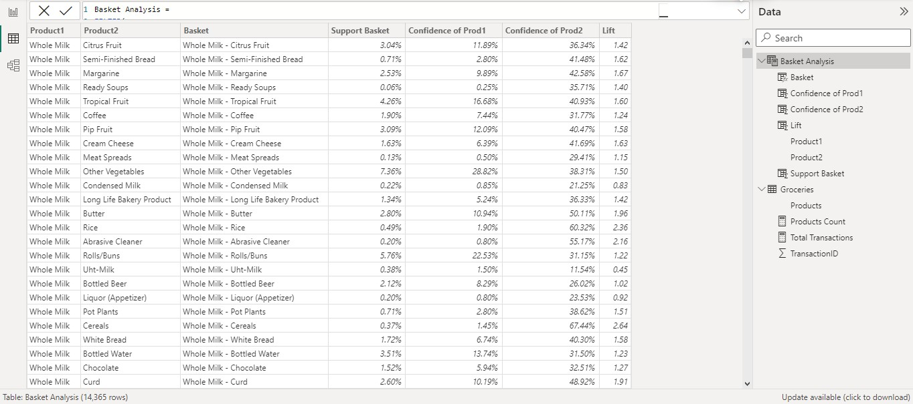
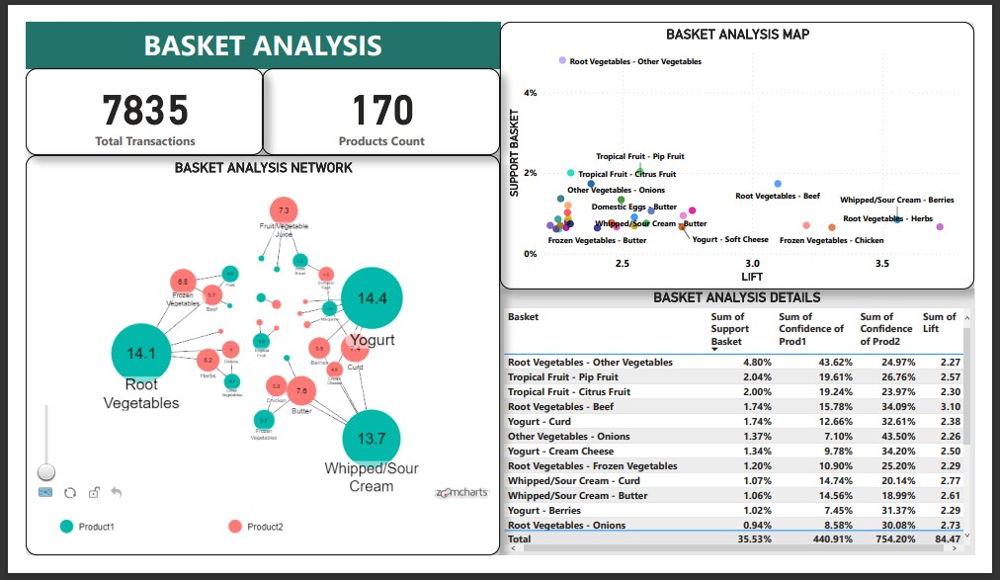

## POWER BI - BASKET ANALYSIS

**__Disclaimer__**: _Dataset and report does not represent any real company, institution or country, but just a dummy dataset for educational purpose only._

## PROJECT BREAKDOWN

1.  What is Basket analysis ?
2.  Its benefits and use cases.
3.  The three key concepts: Support,Confidence,and Lift.
4.  Problem statement
5.  Format and preparation of data.
6.  Utilizing DAX functions to write the formula's needed for the calculations.
7.  Visualise and present the findings of the Analysis in an interactive dashbord.

## INTRODUCTION
This is an analytical technique used to uncover the association between items.It helps to uncover products 
commonly bought together.It is also sometime referred to as Market Basket Analysis.The dataset contains groceries
products spread over multiple columns with each row representing a product transaction.Some rowa have two,three or
more product or items in a row.

## PROBLEM STATEMENT.
Create a list of all the possible combination of two items from all the items found in the dataset transaction
and then carry out a basket analysis to see which items or products have a great association with each other using
the concepts of Support,Confidence and Lift.

## USE CASES.
1. It helps in store layout planning.
2. Product recommendations.
3. Cross-Selling Strategies.
4. Pricing and sales Strategies. 
5. Dishes ordered together mostly in a restaurant.

## KEY CONCEPTS IN BASKET ANALYSIS.
1. SUPPORT: This is the percentage of transactions that include two specific products.Support indicates
               the frequency of the products bought together.A high support means that the basket analysis
               stats are more reliable and additionally higher support makes the basket of products financially
               more entrusting.Formula for Support is;
               SUPPORT = Number of transactions including both products/Total number of transactions

2. CONFIDENCE: This is the percentage of transactions that contain the two products together,out of the 
                  transactions containing one of the two products. Confidence indicates the direction of cross selling.
                  Confidence is calculated separately for each product in basket,which is;
                  Confidence of Product One = Support of basket/Support of product one.
                  Confidence of Product Two = Support of basket/Support of product two.
                  Confidence does not provide the strength of the relationship between two products,hence the 
                  concept of lift.
    
3. LIFT: This gives the strength of the relationship for a basket of products.Lift is calculated by
           LIFT = Support of basket/Support of product one * Support of product two.
           Lift is not in % but rather i decimal.
           Lift ~1: No important relationship between the two items in the basket.
           Lift >1: Indicates a strong relationship between the items in the basket,that the two products are
                    frequently bought together.
           Lift <1: Indicates two products bought together less frequently.

## DATA PREPARATION.
Started by importing the dataset into powerbi desktop,then carried out transformation using power query.transformation
carried out include all of the following steps; 
1.  An index column was added to the dataset using the "Index Column" in "Add Column".
2.  All  other columns except the Index column was unpivoted using the "Unpivot other columns" in "transform tab".
    This is required to show all products or items in a list form in a single column with each transaction of the
    product or items being separated or uniquely identified by their index number.
3.  The Attribute column was removed as it is not need in the analysis.
4.  All blank rows were removed using the filter at the top of the column.
5.  First letter of each product name was capitalised using the "capitalise Each Word" in the "Transform Tab".
6.  Rename all columns,"Index column" to "TransactionID" and the "Value column" to "Product column".
7.  Finally close and apply to load our transformed data into powerbi data model.

Raw dataset                                 |                Cleaned dataset
:-----------------------------------------: | :-----------------------------------------:
                        |    

## DAX FUNCTIONS,MEASURES AND CALCULATED COLUMNS.
1.  Created a measure called total transactions by counting the distinct "TransactionID".
2.  Created another measure to count the distinct products in the "Product column".
3.  On the data view tab,i created a new table called basket analysis,then write a Dax functions using "VALUES,CROSSJOIN,
    FILTER,and SELECTCOLUMN" to get a possible combination of two products.
4.  Created a new column called "Basket" which will include the two products together by concatinating product1 and
    product 2,to give a list of cross product in a row.
5.  Next is the support calculation,which was done by creating a new column.Calculated Columns are used instead 
    of measures because all calculations done are row level calculations.Using dax,i store product1 and 
    product2 inside of a variable,then get all product1 and product2 transactions from the groceries table.
    Still using dax,all transactions containing product one and product two were then gotten using the 
    "INTERSECT" function and then calculate for Support.
6.  Created two columns for product1 and product2 Confidence calculations using dax functions.
7.  Get the relationship between the two products by calculating for Lift,still using dax.
8.  Visualise the data, then filterd by "sum of lift > [2.2]" and "sum of basket support > [0.6%]" to get 
    detailed association insight from the two products.

Dashboard

Click on the following link to interact with the dashboard. https://app.powerbi.com/groups/me/reports/f8d7a08a-af00-4c02-b422-79292ccaa34d/ReportSection?experience=power-bi

